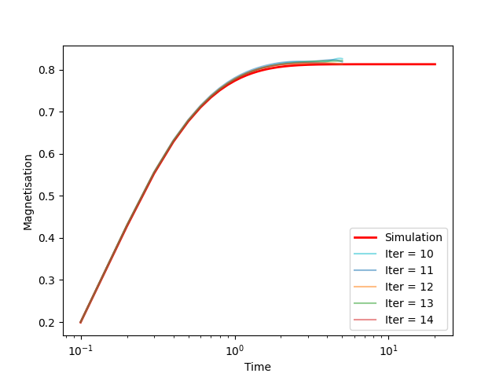
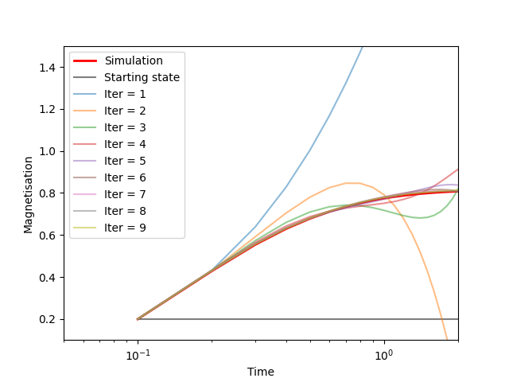

# Rigorous-dynamical-mean-field-theory
Code for integrating the DMFT equation as in [ADD ARXIV LINK]



# Dependencies
- Numpy version 1.22.2
- Scipy version 1.7.1
- MPI4PY version 3.0.3
- Matplotlib version 3.5.1
- Pandas version 1.3.2

Note that MPI4PY also requires a MPI implementation. The code has been tested with MPICH. We refer to the MPI4PY documentation for further information.

A convinient way to setup the enviroment is by using conda and environment.yml

# How to run the code
The code works is written to be executed on multiple cores, but it will also work on single core machines provided an installation if MPI4PY is found.

The default way of launching a Python script will work:

```
python3 main.py
```

This way there will be only one thread provided for the execution. It's also common that the installation of MPI4PY has some issues and every execution will use only 1 thread (but will do so silently). In order to avoid any unintentional mistake in the usage we included a warning if the code is run with only 1 thread.

The way we recommend the code to be run with n_thread is:
```
mpiexec -n {n_thread} python3 main.py
```
# How to integrate the equations
The first place to look at is the `loss_functions.py` file. It contains the definition of the loss functions and the sample selection process (so you can specify the loss and the algorithm).

The next step is to specify the parameters in the file `parameters.json`. We list all the parameters and their meaning here:

- `m_0`: starting overlap with the optimal weights
- `alpha`: ratio of number of samples and dimension of the weights
- `b`: fraction of the number of samples to be included in each batch
- `dt`: learning rate
- `T`: number of gradient descent iterations
- `n_samples`: number of stochastic processes sampled
- `n_iterations`: number of iterations in the DMFT fixed point scheme
- `damping`: weight to average the current guess of the kernels with the previous one. 1 ignores the previous one, 0 ignores the previous one.

You can compute the DMFT fixed point iteration by running `main.py`. 

It's necessary to have a `data` folder (the script will not return an error if it's not there).

We believe it's possible to use the code without modifying the `main.py` file and simply changing the parameters.json configuration file. 

Changing main.py can be usefull to define custom iterations. Any main file should initialise an MPI pool, then it can compute iterations by calling `iterate` or a starting ansatz using `init`.

Every iteration (including the starting ansatz) is saved independently as a dictionary in Pickle format inside data. `load_data` and `save_data` are convinient utilities in `utils.py` to load and save the data quickly. They are both called by defauilt inside `iterate` and `init`, so the code can be interrupted between iterations without loosing progress.

Note that running the code will make each of the threads compute `n_samaples` stochasting processes, so while using more than 1 thread will likely increase the accuracy of the result, you can reasonably expect that the time required for each iteration will not depend on on `n_threads`. We find this reasonable as typical applications require a large number of samples.

The damping factor is extremely important for the performance. Ideally you would start with a high damping factor and then decrease it after a certain number of iterations.

We recomend to do all the printing using `print_MPI`. It will designate a single thread to the printing and redirect the output to `progress.log`.

# How view the results
A convenient plotting script is provided as well as some utilities for plotting in `utils_plot`. 

Running plot.py will visualise the magnetisation at the first and last steps of the iteration and it's a fast way to see if the procedure worked. Since the iteration depends on averages over random processes having `n_samples` high enough is crucial for an accurate prediction. We expect the required number of samples to increase as you increase `T`.

The `main.py` file that is provided will generate the iteration data that we provide with the repository. A typical run should take about 3 minutes on a personal computer.

We also provided a numerical simulation for comparison. Note that this plot reproduces the one in [INSERT PAPER NAME]




# Frequently Asked Questions

## I am a big fan of Jupyter noteboks/Google Colab. What should I do?
You should't have any problem with plotting and loading/saving data.

All the functions that require MPI communication will need MPI4PY. It can be installed on Colab by using:

```
!pip install mpi4py
```

Wether you are using Colab or not, a function with MPI execuded in a Jupyter cell will use only 1 worker. To actually exploit multiple threads you will need to put everything in a Python script and run it using:

```
!mpiexec --allow-run-as-root -n {n_threads} python3 {Python scipt}
```

It's not the most convenient solution but it still allows you to use Colab for your computation.